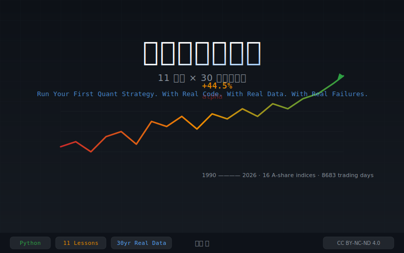

<p align="center">
  
</p>

<h1 align="center">从零开始跑量化</h1>
<h3 align="center">11 堂课 × 30 年真实数据 · 16 个 A 股指数 · 8683 个交易日</h3>

> **Turn "what should I buy?" into "what does the data say?"**
> *A practitioner's guide to quantitative thinking — with real code, real data, and real failures.*
>
> A practitioner's guide to quantitative thinking — with real code, real data, and real failures.

[](https://creativecommons.org/licenses/by-nc-nd/4.0/)
[](LICENSE)
[](https://www.python.org/)

---

## Why This Book Exists

Most quant books teach you strategies that "worked in backtesting." This book teaches you **why they fail in reality** — and what to do about it.

The headline finding: A PE quantile strategy showed **+44.5% annual alpha** on 2000-2017 data. When the data window extended to 1990-2026, alpha collapsed to **+0.1%**. The strategy was never real — it was a sample bias.

**This book is the firsthand account of watching that happen.**

## What You'll Learn

| # | Chapter | Core Question | Code |
|:-:|---------|--------------|:--:|
| 0 | Preface | Why these strategies are not for trading | — |
| 1 | Descriptive Statistics | Which index is the riskiest? | [lesson1](code/lesson1_descriptive.py) |
| 2 | PE Quantile | Is it cheap relative to its own history? | [lesson2](code/lesson2_pe_quantile.py) |
| 3 | Mean-StdDev | How far from normal is the PE? | [lesson3](code/lesson3_mean_std.py) |
| 4 | Monte Carlo | What's the full range of possible futures? | [lesson4](code/lesson4_monte_carlo.py) |
| 5 | Signal Trading | Are external signals worth following? | [lesson5](code/lesson5_signals.py) |
| 6 | Return Distributions | Do returns look like a bell curve? | [lesson6](code/lesson6_return_dist.py) |
| 7 | Calendar Patterns | Do streaks predict reversals? | [lesson7](code/lesson7_calendar.py) |
| 8 | Online Statistics | Did my backtest cheat? | [lesson8](code/lesson8_online_update.py) |
| 9 | Momentum | Does trending beat mean-reversion? | [lesson9](code/lesson9_momentum.py) |
| 10 | Sharpe Ratio | How much return per unit of risk? | [lesson10](code/lesson10_sharpe.py) |
| 11 | Strong-Weak | What can jump levels tell us? | [lesson11](code/lesson11_strong_weak.py) |
| 12 | Final Chapter | From backtest to wisdom | — |

## Quick Start

```bash
git clone https://github.com/Justinjchen-Cornell/quant-from-zero.git
cd quant-from-zero
pip install -r requirements.txt
python code/lesson1_descriptive.py
```

**Pre-packaged data included.** 16 A-share indices from 1990 to 2026, plus PE data for CSI300, SH50, CSI500, and SZ Dividend. No API keys needed to start.

## Repository Structure

```
quant-from-zero/
├── README.md                    # This file
├── LICENSE                      # Code: MIT / Book: CC BY-NC-ND 4.0
├── requirements.txt             # Python dependencies (numpy, pandas, matplotlib, akshare)
├── code/                        # 11 runnable Python lessons (MIT License)
│   ├── lesson1_descriptive.py
│   ├── lesson2_pe_quantile.py
│   ├── ...
│   └── update_data.py           # Pull latest data from akshare
├── data/                        # Pre-packaged data (1990-2026)
│   ├── index_updated.csv        # 16 indices x 8683 days
│   └── *_pe_weekly.csv          # PE data for 4 indices
├── output/charts/               # Generated charts from all lessons
├── book/                        # Book manuscript (CC BY-NC-ND 4.0)
│   ├── LICENSE                  # Book-specific license
│   └── chapters/                # 13 chapter files
└── references/                  # Bibliography
```

## License

- **Code** (`code/`): [MIT License](LICENSE) — free to use, modify, and distribute.
- **Book** (`book/`): [CC BY-NC-ND 4.0](book/LICENSE) — free to read and share. Commercial use and derivative works require written authorization.
- **Data** (`data/`): Public domain — sourced from akshare, a free financial data library.

## Data Source

All index data from [akshare](https://github.com/akfamily/akshare). Run `python code/update_data.py` to pull the latest data directly from Chinese exchanges.

## About the Author

**Chen Jia (陈嘉)** — 16 years in asset management, private equity, and carbon finance. Tsinghua-Cornell MBA. This book emerged from the Chen Jia Knowledge Hub, an Obsidian vault with 12,600+ interconnected notes.

## Star History

If this book helps you, please consider [starring the repo](https://github.com/Justinjchen-Cornell/quant-from-zero) and sharing it with someone who needs it.
